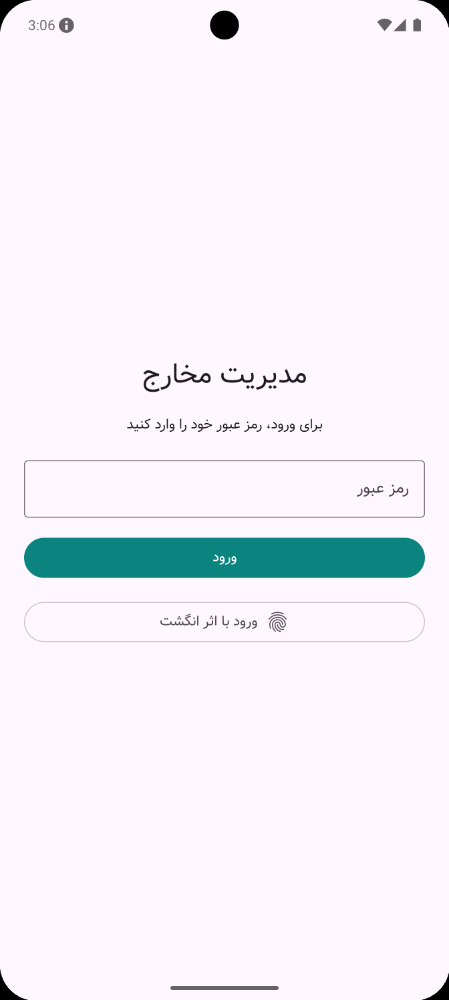
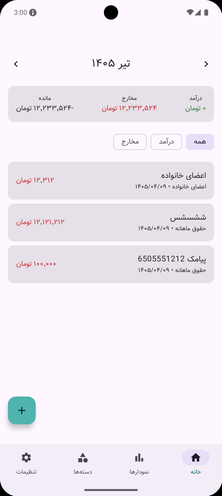
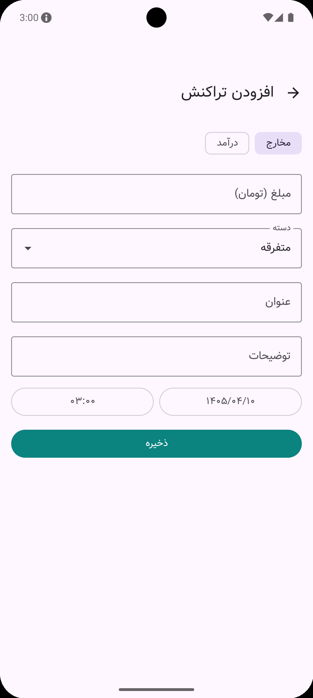
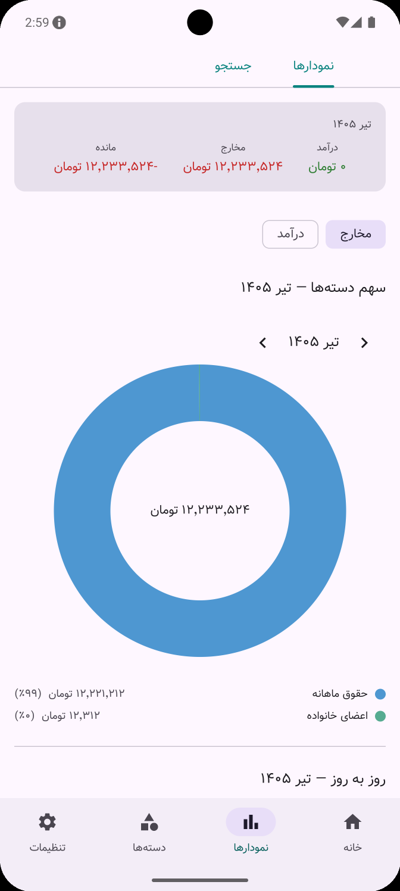
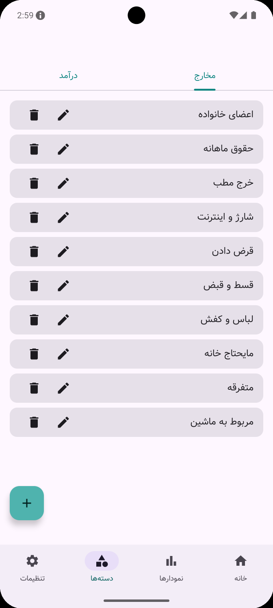
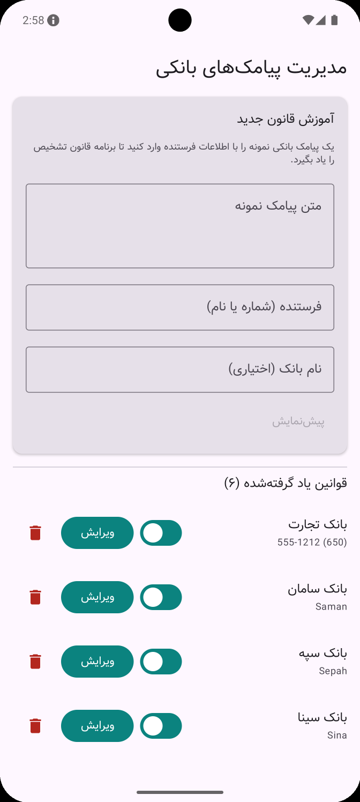
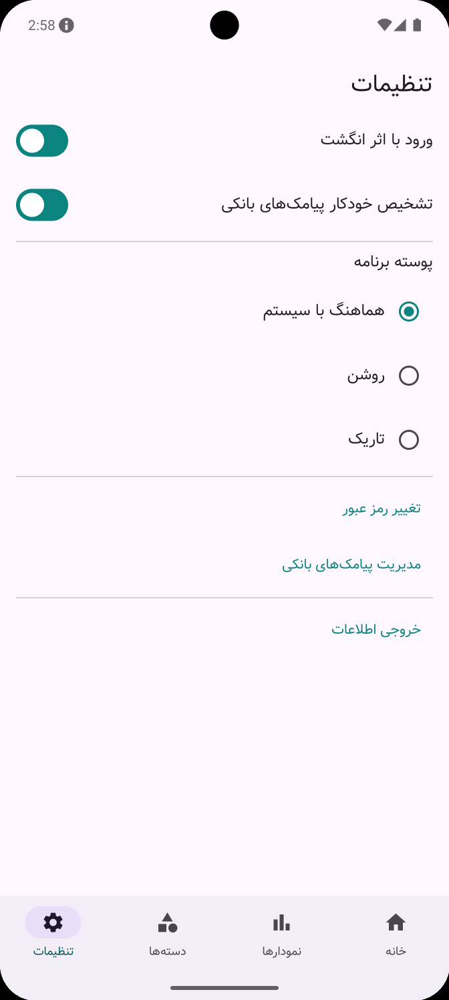
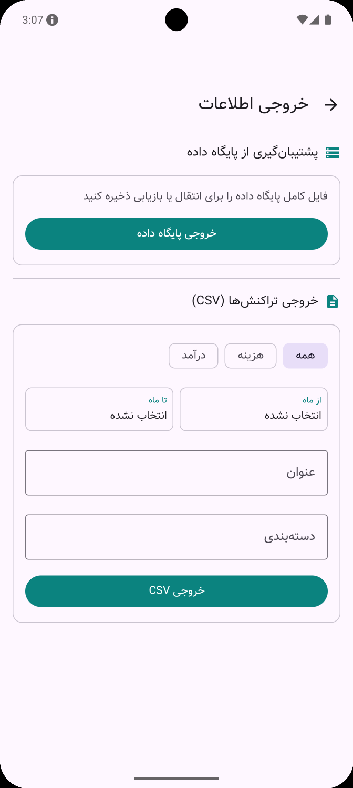
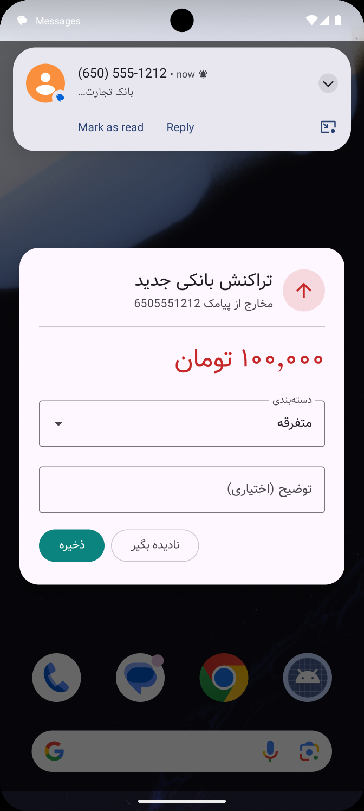

# MoneyManager

A Persian-first personal finance app for Android, built with Kotlin and Jetpack Compose. Track income and expenses, browse reports with charts, and optionally let the app read bank SMS messages to log transactions automatically — all with a Shamsi (Jalali) calendar and Persian-digit formatting throughout the UI. The app is protected behind a password/biometric lock screen and re-locks automatically whenever it leaves the foreground.

---

## Screenshots

| Login | Home | Add / Edit Transaction |
|---|---|---|
|  |  |  |

| Charts | Categories | Bank Rules |
|---|---|---|
|  |  |  |

| Settings | Data Export | Overlay Screen |
|---|---|---|
|  |  |  |

---

## Features

- **Transaction management** — Add, edit, and delete income/expense entries with Persian-digit amount formatting and a Shamsi date/time picker.
- **Home dashboard** — Month-by-month transaction list with income/expense filter chips and per-month navigation.
- **Reports** — Category-breakdown pie/bar charts, daily-total charts, monthly trend charts, and a full-text/category/type search over all transactions.
- **Automatic SMS parsing** — An optional foreground service reads incoming bank SMS messages, matches them against configurable per-bank rules, and prompts the user to save the parsed transaction. A "teach" screen lets users create new bank rules from a sample SMS body.
- **Categories** — Manage custom income and expense categories; delete with reassignment or bulk-delete of linked transactions.
- **Authentication** — Password lock screen with optional biometric (fingerprint) unlock; the app automatically re-locks when it's backgrounded or closed.
- **Settings** — Toggle the SMS service, biometric auth, and dark/light/system theme.
- **Legacy migration** — One-time import wizard that reads the SQLite database from the previous version of the app and migrates all transactions and categories.
- **Home-screen widget** — Glance-based widget showing the current month's balance at a glance.
- **Firebase Crashlytics** — Automatic crash reporting in release builds.
- **Kill-switch** — Firebase Cloud Messaging listener that can remotely toggle app features.

---

## Tech Stack

| Layer | Technology |
|---|---|
| Language | Kotlin 2.4 |
| UI | Jetpack Compose (BOM 2026.06) + Material 3 |
| Navigation | Navigation 3 (androidx.navigation3) |
| DI | Hilt 2.60 |
| Database | Room 2.8 |
| Preferences | DataStore |
| Async | Kotlin Coroutines + Flow |
| Charts | Vico 3.2 |
| Background | WorkManager + Foreground Service |
| Security | AndroidX Biometric + Security-Crypto |
| Widget | Glance 1.1 |
| Firebase | Crashlytics + Cloud Messaging |
| Build | AGP 9.2 · Gradle convention plugins · KSP · Version catalog |

---

## Module Structure

```
MoneyManager/
├── app/                        # Application entry point, navigation host, DI wiring
├── build-logic/
│   └── convention/             # Shared Gradle convention plugins
├── core/
│   ├── common/                 # ShamsiCalendar, shared utilities
│   ├── data/                   # Repository implementations, SMS heuristic parser, legacy reader
│   ├── database/               # Room database, DAOs, entities, type converters
│   ├── datastore/              # DataStore user preferences source
│   ├── designsystem/           # Theme, colors, typography
│   ├── domain/                 # Use cases (transaction, category, chart, auth)
│   ├── model/                  # Pure Kotlin data models (no Android/framework deps)
│   ├── testing/                # Shared test fakes (TestTransactionRepository, etc.)
│   └── ui/                     # Shared Compose components, Persian number formatter, Shamsi date picker
└── feature/
    ├── auth/impl/              # PIN + biometric lock screen
    ├── categories/impl/        # Category list, add, rename, delete
    ├── home/impl/              # Monthly transaction list dashboard
    ├── migration/impl/         # Legacy database import wizard
    ├── reports/impl/           # Charts and transaction search
    ├── settings/impl/          # App settings
    ├── sms/impl/               # Bank SMS rule management and teach screen
    └── transaction/impl/       # Add / edit transaction form
```

Each `feature/*` module owns its own screen, ViewModel, and UiState. Api modules (where present) expose navigation contracts. The `core:domain` layer is framework-free use cases; `core:data` holds the real repository implementations and the `core:database` / `core:datastore` dependencies they wrap.

---

## Architecture

Clean Architecture layered as:

```
UI (Compose)  ←→  ViewModel (StateFlow/UiState)  ←→  Use Cases  ←→  Repositories  ←→  Room / DataStore / SMS
```

- **Unidirectional data flow**: each screen exposes a single `StateFlow<UiState>` and a set of intent functions.
- **Single-activity**: one `Activity`, all screens rendered as Composables wired through the Navigation 3 back stack.
- **Convention plugins**: build config (minSdk, compileSdk, Compose, Hilt, Room) is defined once in `build-logic/convention` and applied via Gradle alias plugins.

---

## Requirements

- Android **API 26** (Android 8.0) or higher
- Android Studio **Narwhal** (or any version that supports AGP 9.x)
- JDK 17

---

## Building

```bash
# Debug build
./gradlew assembleDebug

# Run all unit tests
./gradlew test

# Run ktlint checks
./gradlew ktlintCheck
```

### Release signing

Release builds are signed via environment variables (no keystore committed to the repo):

```bash
export SIGNING_STORE_PATH=/path/to/keystore.jks
export SIGNING_KEY_ALIAS=mykey
export SIGNING_KEY_PASSWORD=secret
./gradlew assembleRelease
```

If the environment variables are absent the release APK is built unsigned.

---

## Project Conventions

- **No mocking**: test fakes live in `core:testing` (`TestTransactionRepository`, `TestCategoryRepository`, etc.) and use real in-memory logic instead of mocks.
- **StateFlow + WhileSubscribed**: all ViewModels expose `StateFlow` with `SharingStarted.WhileSubscribed(5_000)`. Tests subscribe via Turbine's `.test {}` before asserting on emitted values.
- **Persian numbers**: all amounts displayed to the user go through `PersianNumber.grouped()` which converts digits and inserts Persian-locale thousands separators.
- **Shamsi calendar**: `ShamsiCalendar` (in `core:common`) handles all Jalali ↔ Gregorian conversions; no Gregorian dates are shown in the UI.
